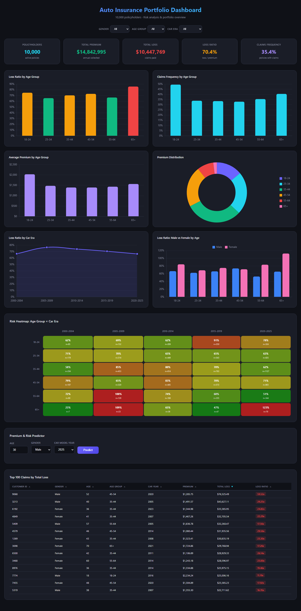
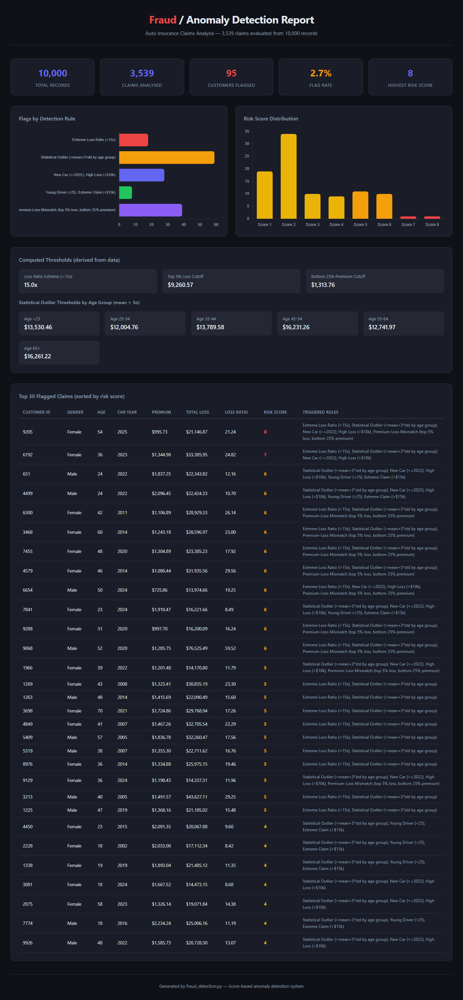

# Auto Insurance AI Demo

> A full suite of AI-powered analytics tools built in a single session with **Claude Code** — demonstrating how LLM-based agents can dramatically accelerate development.


---

## What's Inside

| Deliverable | File | Description |
|---|---|---|
| Mock Data Generator | `generate_mock_data.py` | 10,000 synthetic policyholders with realistic risk correlations |
| Interactive Dashboard | `auto_insurance_dashboard.html` | Dark-themed analytics dashboard with 6 charts, heatmap & predictor |
| Fraud Detection | `fraud_detection.py` | Rule-based anomaly scoring — flags suspicious claims |
| AI Data Chatbot | `data_chatbot.py` | Flask app — ask questions in plain English via Claude or Gemini |
| PDF Actuarial Report | `create_pdf_report.py` | 6-page professional report at 600 DPI (reportlab + matplotlib) |
| PowerPoint Presentation | `create_presentation.py` | 12-slide deck showcasing all features |

---

## Screenshots

### Interactive Dashboard



> 10,000 policyholders • KPI cards • 6 Chart.js charts • Risk heatmap (Age × Car Era) • Premium & Risk Predictor • Sortable claims table

---

### Fraud / Anomaly Detection Report



> 95 flagged claims out of 3,539 (2.7%) • 5 scoring rules • Risk score distribution • Top flagged cases with reasoning

---

## Quick Start

### 1. Generate Mock Data

```bash
pip install pandas numpy openpyxl
python generate_mock_data.py
```

Outputs: `auto_insurance_data.csv`, `auto_insurance_data.xlsx`, `dashboard_data.json`

---

### 2. View the Dashboard

Just open the file in your browser — no server needed:

```bash
start auto_insurance_dashboard.html   # Windows
open auto_insurance_dashboard.html    # macOS
```

---

### 3. Run Fraud Detection

```bash
python fraud_detection.py
```

Outputs: `flagged_claims.csv`, `fraud_detection_summary.html`

---

### 4. Run the AI Chatbot

```bash
pip install flask anthropic google-genai
python data_chatbot.py
```

Then open `http://localhost:5000` in your browser.

**Supported models:**

| Provider | Model |
|---|---|
| Anthropic | Claude claude-sonnet-4-6 |
| Anthropic | Claude claude-haiku-4-5-20251001 |
| Google | Gemini 2.0 Flash |
| Google | Gemini 1.5 Pro |
| Google | Gemini 3 Flash Preview |

Enter your API key in the UI — `sk-ant-...` for Anthropic, `AIza...` for Google.

---

### 5. Generate PDF Report

```bash
pip install reportlab matplotlib numpy
python create_pdf_report.py
```

Outputs: `Auto_Insurance_Report.pdf` (6 pages, 600 DPI charts)

---

### 6. Generate PowerPoint Presentation

```bash
pip install python-pptx
python create_presentation.py
```

Outputs: `Auto_Insurance_AI_Demo_V2.pptx` (12 slides)

---

## Tech Stack

- **Data** — `numpy`, `pandas`
- **Charts** — `matplotlib`, `Chart.js`
- **PDF** — `reportlab`
- **PowerPoint** — `python-pptx`
- **Web App** — `Flask`
- **AI** — Anthropic Claude API, Google Gemini API (`google-genai`)
- **Screenshots** — Playwright (headless Chromium)

---

## Dataset

10,000 synthetic auto insurance policyholders with realistic correlations:

- **Age** → younger drivers have higher premiums & loss ratios
- **Car model year** → older vehicles have higher loss ratios
- **Gender** → slight premium/loss differences
- **Claims** → ~35% of policyholders file a claim; losses follow a realistic distribution

---

*Built with [Claude Code](https://claude.ai/claude-code) — Anthropic's AI coding agent*
